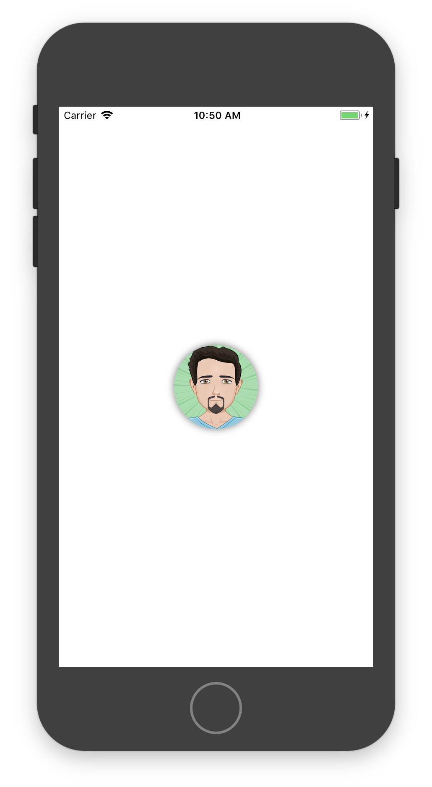
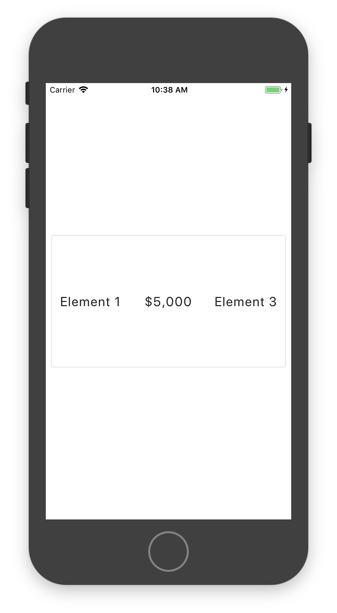
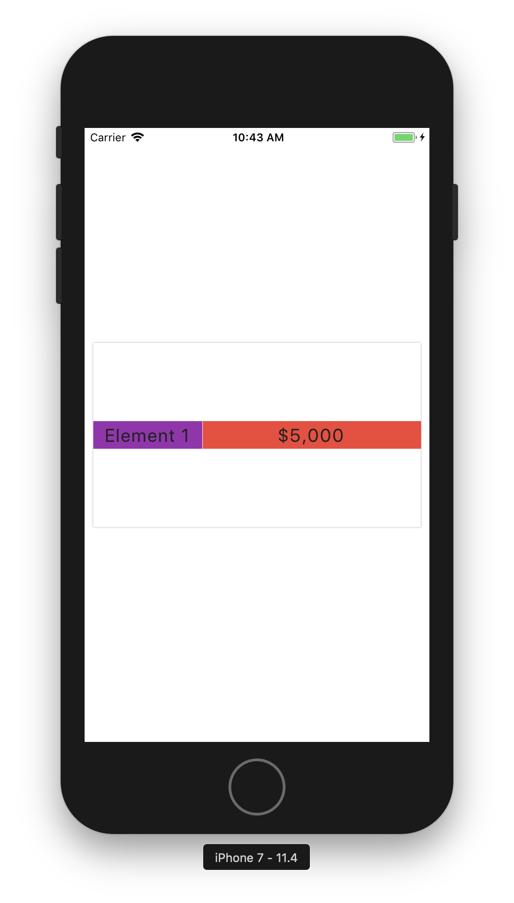
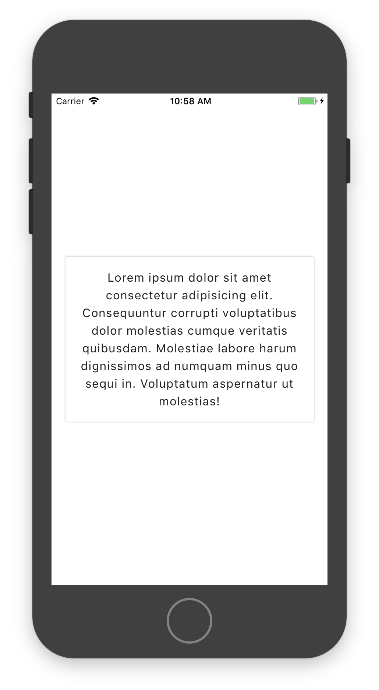
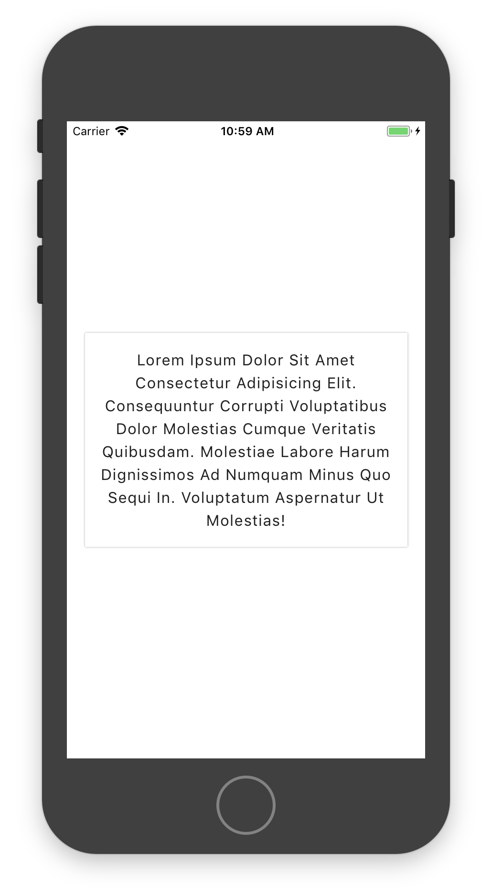
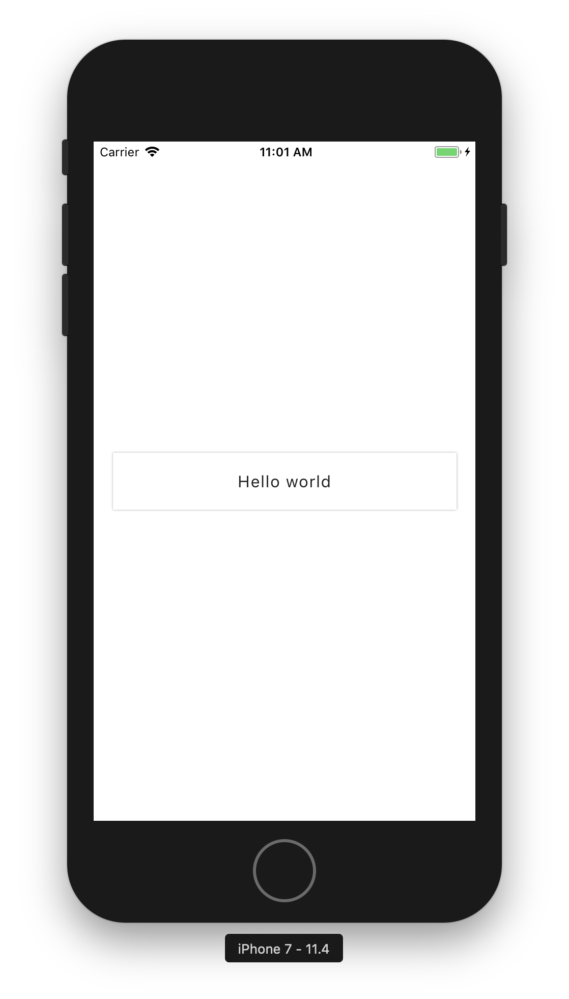
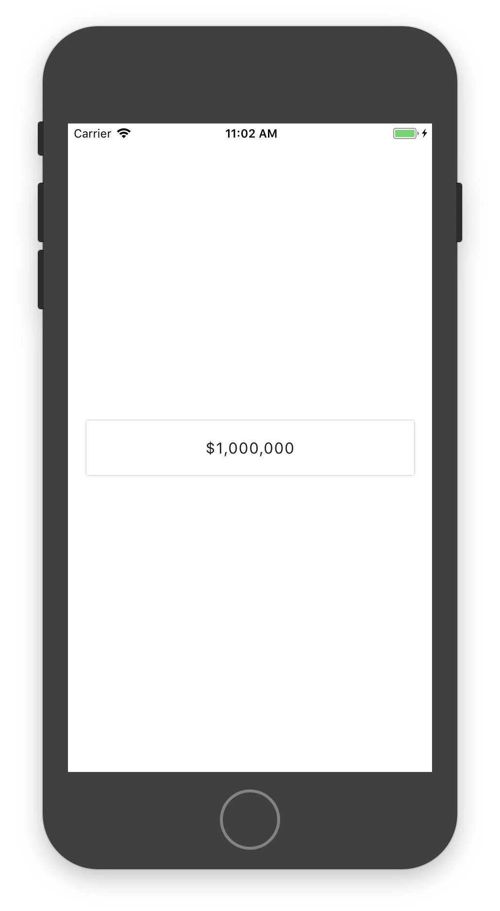

## react-native-design-utlity [Still in development]

[](https://npm.im/react-native-design-utility)

I've been using [Tailwind](https://github.com/tailwindcss/tailwindcss) lately for the web. Loved it, but I didn't find any solution like this for react-native. So I build one who look like it but more for react-native design styling. I've add some text utility like `capitalize`, `capitalizeEach`, `thousand` etc. You pass props and this is pass to the StyleSheet, so this will not affect the perfomance.

When I take a look back on my old project, lot of the time, because importing everytime my constants and metrics file become painful, I make use of hardcoded value. As you know this is not the best way to make an app easier to maintain. If value need to be change all this place where I did that need to ne update manually. All my margin and padding size was the bigger one. Now here just by providing the name as a props I make sure they all follow. No import nothing just like if you install a design framework etc. But now you create your own 😊. Don't worry, all props here have **fallback**. You don't want to use a value for your margin right? You can just do `mr={20}` this will add 20 for the marginRight style. You don't see what you need here. You can make use of the style props and add customStyle.

## Goal of this library

The first goal of this library it's add kind of a design-system yo your app. This will be more easier in the long run to manage all your styling. This will make sure your app is consistent all around. All your margin padding value are the same etc. Also this will remove lot of typing. I feel it easier to wrote design cause, I can do this right inside my View component and not jumping around my style object. If you like inline style this is will be the same. So when you start working in your app the first thing to do would be to generate the theme "see custom style for this" and update it with the value provided by your designer or those see in the sketch, photoshop file.

**Why not use constants file and import it ?**

Here you don't even need that, I make use of the context api and the two component provided receive the theme as a props. So no more 100 files with import color etc. You pass the props and the component do the rest.

## Installation

```
yarn add react-native-design-utility
```

You must add the provider in your root component

```js
import { UtilityThemeProvider } from 'react-native-design-utility';

class App extends Component {
  render() {
    return <UtilityThemeProvider>...rest of your app</UtilityThemeProvider>;
  }
}
```

By default the theme is this.

```js
const color = {
  black: '#212121',

  greyDarkest: '#242424',
  greyDarker: '#616161',
  greyDark: '#757575',
  grey: '#9e9e9e',
  greyLight: '#bdbdbd',
  greyLighter: '#e0e0e0',
  greyLightest: '#eeeeee',

  white: '#fff',

  redDarkest: '#b71c1c',
  redDarker: '#c62828',
  redDark: '#d32f2f',
  red: '#f44336',
  redLight: '#ef5350',
  redLighter: '#e57373',
  redLightest: '#ef9a9a',

  blueDarkest: '#0d47a1',
  blueDarker: '#1565c0',
  blueDark: '#1976d2',
  blue: '#2196f3',
  blueLight: '#42a5f5',
  blueLighter: '#64b5f6',
  blueLightest: '#90caf9',

  purpleDarkest: '#4a148c',
  purpleDarker: '#6a1b9a',
  purpleDark: '#7b1fa2',
  purple: '#9c27b0',
  purpleLight: '#ab47bc',
  purpleLighter: '#ba68c8',
  purpleLightest: '#ce93d8',

  greenDarkest: '#1b5e20',
  greenDarker: '#2e7d32',
  greenDark: '#388e3c',
  green: '#4caf50',
  greenLight: '#66bb6a',
  greenLighter: '#81c784',
  greenLightest: '#a5d6a7',
};

export const theme = {
  text: {
    size: {
      sm: 14,
      base: 16,
      md: 18,
      lg: 20,
      xl: 24,
    },
    weight: {
      light: '200',
      normal: '400',
      bold: '700',
    },
    spacing: {
      tight: 0.8,
      normal: 1,
      wide: 1.5,
    },
    lineHeight: {
      none: 1,
      tight: 1.25,
      normal: 1.5,
      large: 2,
    },
    fonts: {
      base: null,
    },
  },
  color,
  space: {
    xs: 8,
    sm: 16,
    md: 24,
    lg: 36,
    xl: 40,
  },
  radius: {
    xs: 6,
    sm: 10,
    base: 14,
    lg: 20,
    xl: 30,
  },
  opacity: {
    none: 0,
    low: 0.3,
    demi: 0.5,
    high: 0.8,
    base: 1,
  },
  shadows: [
    {
      shadowColor: color.black,
      shadowOffset: {
        width: 0,
        height: 0,
      },
      shadowOpacity: 1,
      shadowRadius: 1,
    },
    {
      shadowColor: color.black,
      shadowOffset: {
        width: 0,
        height: 0,
      },
      shadowOpacity: 0.6,
      shadowRadius: 5,
    },
  ],
  borders: [
    {
      borderWidth: 1,
      borderColor: color.black,
    },
    {
      borderWidth: 2,
      borderColor: color.black,
    },
    {
      borderWidth: 5,
      borderColor: color.black,
    },
  ],
  button: {
    disabled: {
      opacity: 0.5,
    },
  },
};
```

**Color can be any string**

As you can see this give you a good amount of basic style, size and other stuff. The space object is the one use for both the margin and the padding.

## Custom Theme

For initialize the theme you can run.

```
node ./node_modules/react-native-design-utility/dist/init.js
```

This will come with some basic space etc. Also this library provide lot of custom color coming from [Material color ](https://www.materialpalette.com/colors)

You can take a look of the basic theme provide [here](https://github.com/EQuimper/react-native-design-utility/blob/master/lib/theme.ts)

Add the theme to the provider as a props

```js
import { UtilityThemeProvider } from 'react-native-design-utility';

import { theme } from './theme';

class App extends Component {
  render() {
    return (
      <UtilityThemeProvider theme={theme}>
        ...rest of your app
      </UtilityThemeProvider>
    );
  }
}
```

After you can custom any color or size etc. Dont play too much with the key, but you have freedom on the value.

## Usage

```js
import { Box, Text } from 'react-native-design-utility';

class MyComponent extends Component {
  render() {
    return (
      <Box>
        <Box w="20%" bg="red" p="sm" mb="lg">
          <Text
            border={1}
            size="lg"
            color="blueDarker"
            center
            bold
            capitalizeEach
          >
            Lorem ipsum dolor sit amet consectetur adipisicing elit. Quo,
            officiis quae deserunt exercitationem beatae nam atque nesciunt.
            Dolore animi eum magni doloremque velit culpa accusamus voluptatem,
            vero quos ea incidunt?
          </Text>
        </Box>
        <Box w={1} bg="blue" mb="sm" center py="sm" rows={[1, 2, 1]} dir="row">
          <Box bg="redDarker" self="center">
            <Text size="xl" bold capitalize>
              hello
            </Text>
          </Box>
          <Box bg="green">
            <Text size="xl" bold thousand>
              Hell ya $5000
            </Text>
          </Box>
          <Box bg="red">
            <Text size="xl" deco="underline" bold uppercase>
              boom
            </Text>
          </Box>
        </Box>
        <Box border={2} center h={200} w={1 / 2} bg="red">
          <Box h={1 / 3} w={1 / 2} bg="blue" f={1} />
          <Box h={1 / 3} w={1 / 2} bg="green" />
        </Box>
        <Box circle={100} avatar shadow="1" bg="black" mb="sm">
          <Image
            source={{
              uri:
                'https://pbs.twimg.com/profile_images/1022224321740263424/s0Lj7Ph1_400x400.jpg',
            }}
          />
        </Box>
        <Box border={2} align="end" justify="center" h={200} w="100%" bg="red">
          <Box bg="blue" f={1} />
          <Box bg="green" f={2} />
        </Box>
      </Box>
    );
  }
}
```

You can pass all the props available for both View and Text.

## Custom style

You can pass any style props if this is not existing.

Example

```js
<Box size="xl" style={{ borderBottomLeftRadius: 1 }} />
```

---

## Import the type

You can import the type for both component and extends your interface or type if you want.

```js
import { UtilityBoxProps, UtilityTextProps } from 'react-native-design-utility';

interface IProps extends UtilityBoxProps {}

const MyCp = (props: IProps) => (
  ...whatever here
)
```

## Some Example

### Circle and Avatar utility

You want to have a simple avatar in your app. So you pass an Image to the box but now you want it to be round etc. With the Box component you can do this way

```js
export default class App extends React.Component {
  render() {
    return (
      <UtilityThemeProvider theme={theme}>
        <Box f={1} center>
          <Box avatar circle={100} shadow={1}>
            <Image source={{ uri: avatarUrl }} />
          </Box>
        </Box>
      </UtilityThemeProvider>
    );
  }
}
```

Here you pass the props avatar to let know the box this will have an Image type component as a children. After this you can put circle with a number who is the value of the height and the width of the view. This is will be pass down to the child

Result:



### Flex rows utlity

A box can receive a rows props. This one can be an array of number. This will provided flex to his children depend of the indexof inside the array.

Example here we pass an array of only 1. This way each child receive it. If indexof is not find 1 is provided so that's why you can do this way here.

```js
export default class App extends React.Component {
  render() {
    return (
      <UtilityThemeProvider theme={theme}>
        <Box f={1} center>
          <Box
            shadow={0}
            bg="white"
            w="95%"
            h={200}
            dir="row"
            rows={[1]}
            align="center"
          >
            <Box center>
              <Text size="lg">Element 1</Text>
            </Box>
            <Box center>
              <Text thousand size="lg">
                $5000
              </Text>
            </Box>
            <Box center>
              <Text capitalize size="lg">
                element 3
              </Text>
            </Box>
          </Box>
        </Box>
      </UtilityThemeProvider>
    );
  }
}
```

Result:



Another example if you provide `rows={[1, 2]}` this will give you this kind of behavior

```js
export default class App extends React.Component {
  render() {
    return (
      <UtilityThemeProvider theme={theme}>
        <Box f={1} center>
          <Box
            shadow={0}
            bg="white"
            w="95%"
            h={200}
            dir="row"
            rows={[1, 2]}
            align="center"
          >
            <Box bg="purple" center>
              <Text size="lg">Element 1</Text>
            </Box>
            <Box bg="red" center>
              <Text thousand size="lg">
                $5000
              </Text>
            </Box>
          </Box>
        </Box>
      </UtilityThemeProvider>
    );
  }
}
```

Result:



### Text Manipulation utilty

##### center

```js
export default class App extends React.Component {
  render() {
    return (
      <UtilityThemeProvider theme={theme}>
        <Box f={1} center>
          <Box bg="white" p="sm" w="90%" shadow={0}>
            <Text center>
              Lorem ipsum dolor sit amet consectetur adipisicing elit.
              Consequuntur corrupti voluptatibus dolor molestias cumque
              veritatis quibusdam. Molestiae labore harum dignissimos ad numquam
              minus quo sequi in. Voluptatum aspernatur ut molestias!
            </Text>
          </Box>
        </Box>
      </UtilityThemeProvider>
    );
  }
}
```

Result:



##### capitalizeEach

```js
export default class App extends React.Component {
  render() {
    return (
      <UtilityThemeProvider theme={theme}>
        <Box f={1} center>
          <Box bg="white" p="sm" w="90%" shadow={0}>
            <Text center capitalizeEach>
              Lorem ipsum dolor sit amet consectetur adipisicing elit.
              Consequuntur corrupti voluptatibus dolor molestias cumque
              veritatis quibusdam. Molestiae labore harum dignissimos ad numquam
              minus quo sequi in. Voluptatum aspernatur ut molestias!
            </Text>
          </Box>
        </Box>
      </UtilityThemeProvider>
    );
  }
}
```

Result



##### capitalize

```js
export default class App extends React.Component {
  render() {
    return (
      <UtilityThemeProvider theme={theme}>
        <Box f={1} center>
          <Box bg="white" p="sm" w="90%" shadow={0}>
            <Text center capitalize>
              hello world
            </Text>
          </Box>
        </Box>
      </UtilityThemeProvider>
    );
  }
}
```

Result:



##### thousand

```js
export default class App extends React.Component {
  render() {
    return (
      <UtilityThemeProvider theme={theme}>
        <Box f={1} center>
          <Box bg="white" p="sm" w="90%" shadow={0}>
            <Text center thousand>
              $1000000
            </Text>
          </Box>
        </Box>
      </UtilityThemeProvider>
    );
  }
}
```

Result:



---

## Components

### Box

| Props    | Value                                                 | Description                                                                        |
| -------- | ----------------------------------------------------- | ---------------------------------------------------------------------------------- |
| m        | xs, sm, md, lg, xl or any number                      | margin                                                                             |
| mt       | xs, sm, md, lg, xl or any number                      | marginTop                                                                          |
| mb       | xs, sm, md, lg, xl or any number                      | marginBottom                                                                       |
| mr       | xs, sm, md, lg, xl or any number                      | marginRight                                                                        |
| ml       | xs, sm, md, lg, xl or any number                      | marginLeft                                                                         |
| my       | xs, sm, md, lg, xl or any number                      | marginVertical                                                                     |
| mx       | xs, sm, md, lg, xl or any number                      | marginHorizontal                                                                   |
| p        | xs, sm, md, lg, xl or any number                      | padding                                                                            |
| pt       | xs, sm, md, lg, xl or any number                      | paddingTop                                                                         |
| pb       | xs, sm, md, lg, xl or any number                      | paddingBottom                                                                      |
| pr       | xs, sm, md, lg, xl or any number                      | paddingRight                                                                       |
| pl       | xs, sm, md, lg, xl or any number                      | paddingLeft                                                                        |
| py       | xs, sm, md, lg, xl or any number                      | paddingVertical                                                                    |
| px       | xs, sm, md, lg, xl or any number                      | paddingHorizontal                                                                  |
| center   | boolean                                               | center element with flex                                                            |
| border   | number                                                | give border at index, null will remove any border                                  |
| shadow   | number                                                | give shadow at index                                                               |
| h        | number, fraction or string                            | height                                                                             |
| w        | number, fraction or string                            | width                                                                              |
| bg       | string                                                | backgroundColor                                                                    |
| o        | none, low, demi, high, base, any string or any number | opacity                                                                            |
| dir      | col, col-reverse, row, row-reverse                    | flexDirection                                                                       |
| align    | start, end, center, stretch, baseline                 | alignItems                                                                         |
| justify  | start, end, center, between, around, evenly           | justifyContent                                                                     |
| self     | start, end, center, auto, stretch, baseline           | alignSelf                                                                          |
| flexWrap | wrap, nowrap                                          | flexWrap                                                                             |
| f        | number                                                | flex value                                                                          |
| rows     | array of number                                       | add flex value to child Box at indexof, default 1 if not provide                    |
| circle   | number                                                | create a circle with the size provided                                             |
| avatar   | boolean                                               | if child is one Image will put this one in circle, must provided circle props also |
| radius   | xs, sm, base, lg, xl, number, boolean, string         | borderRadius, if true default is base                                              |
| position | relative, absolute                                    | position                                                                           |
| style    | stylesheet                                            | any other style                                                                    |

### Text

| Props          | Value                                                 | Description                                                          |
| -------------- | ----------------------------------------------------- | -------------------------------------------------------------------- |
| m              | xs, sm, md, lg, xl or any number                      | margin                                                               |
| mt             | xs, sm, md, lg, xl or any number                      | marginTop                                                            |
| mb             | xs, sm, md, lg, xl or any number                      | marginBottom                                                         |
| mr             | xs, sm, md, lg, xl or any number                      | marginRight                                                          |
| ml             | xs, sm, md, lg, xl or any number                      | marginLeft                                                           |
| my             | xs, sm, md, lg, xl or any number                      | marginVertical                                                       |
| mx             | xs, sm, md, lg, xl or any number                      | marginHorizontal                                                     |
| p              | xs, sm, md, lg, xl or any number                      | padding                                                              |
| pt             | xs, sm, md, lg, xl or any number                      | paddingTop                                                           |
| pb             | xs, sm, md, lg, xl or any number                      | paddingBottom                                                        |
| pr             | xs, sm, md, lg, xl or any number                      | paddingRight                                                         |
| pl             | xs, sm, md, lg, xl or any number                      | paddingLeft                                                          |
| py             | xs, sm, md, lg, xl or any number                      | paddingVertical                                                      |
| px             | xs, sm, md, lg, xl or any number                      | paddingHorizontal                                                    |
| center         | boolean                                               | text-align center                                                    |
| left           | boolean                                               | text-align left                                                      |
| right          | boolean                                               | text-align right                                                     |
| border         | number                                                | give border at index                                                 |
| color          | string                                                | color, default black in theme                                        |
| size           | sm, base, md, lg, xl, any string or any number        | fontSize, default is base                                            |
| weight         | string                                                | fontWeight, default is normal                                        |
| bold           | boolean                                               | fontWeight bold in theme, , default is normal                        |
| normal         | boolean                                               | fontWeight normal in theme, , default is normal                      |
| light          | boolean                                               | fontWeight light in theme, , default is normal                       |
| lineH          | none, tight, normal, large, any number or any string  | lineHeight                                                           |
| ls             | tight, normal, wide, any string or any number         | letter-spacing                                                       |
| o              | none, low, demi, high, base, any string or any number | opacity                                                              |
| uppercase      | boolean                                               | uppercase all letters                                                |
| lowercase      | boolean                                               | lowercase all letters                                                |
| capitalize     | boolean                                               | capitalize only first letter of first word                             |
| capitalizeEach | boolean                                               | capitalize each first letter of every word                            |
| thousand       | boolean                                               | add a comma to a number when more than 3 zero                        |
| italic         | boolean                                               | fontStyle italic                                                     |
| deco           | underline, none, through, underline-through           | textDecorationLine                                                   |
| font           | string                                                | fontFamily, if fonts object exist with base this will be the default |
| style          | stylesheet                                            | any other style                                                      |

## TODO

- [x] Add alignSelf to box
- [ ] Add hitslop utility to box
- [ ] Update Readme with better example and better docs
- [ ] Create clone app for show how to use this lib
